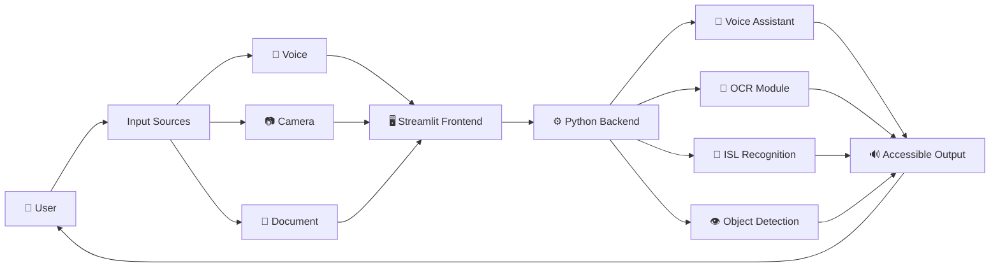
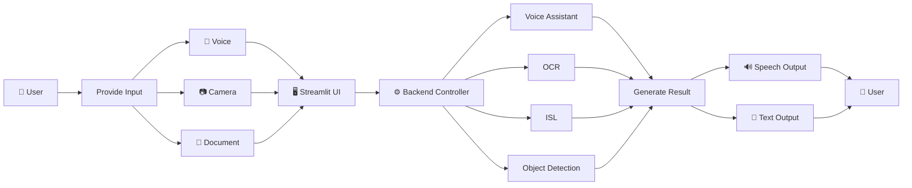
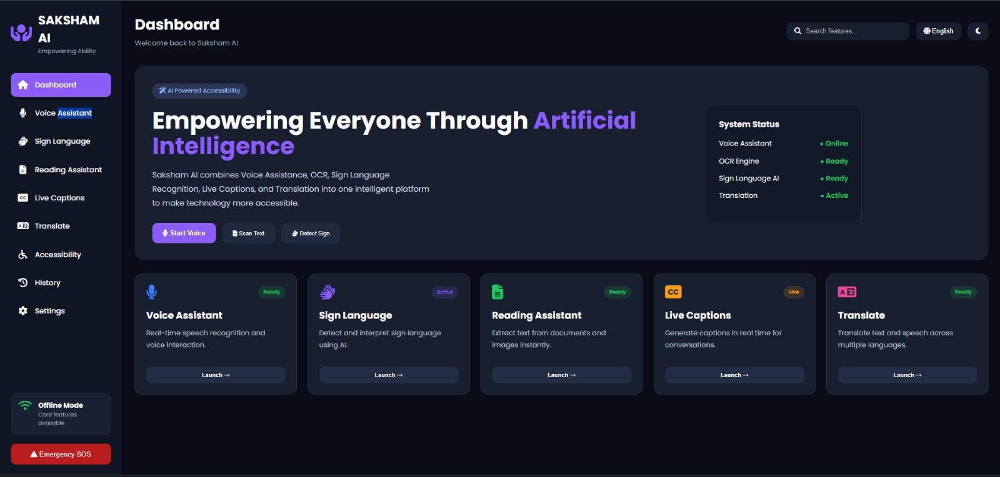
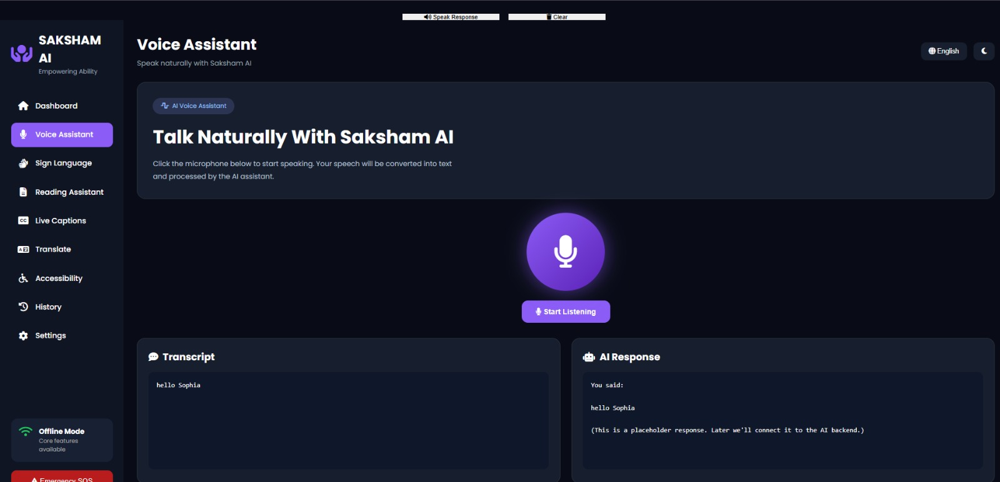
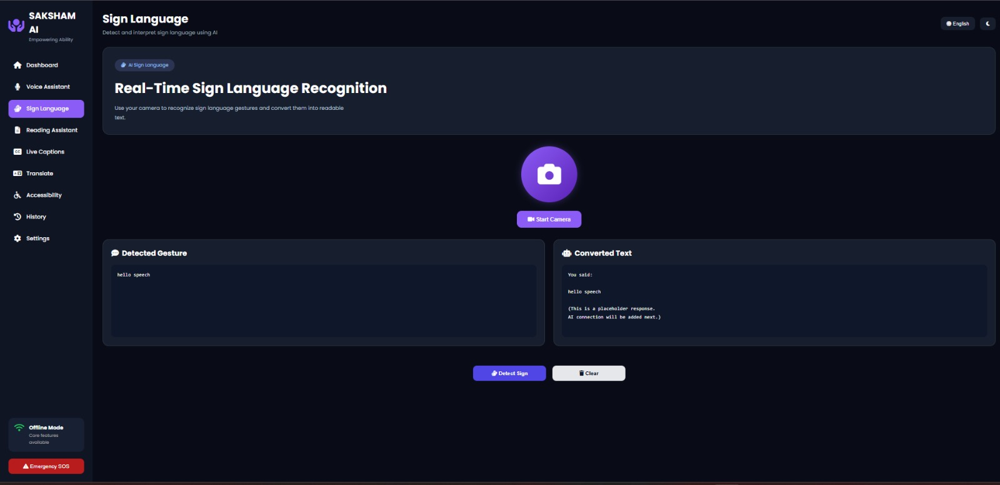
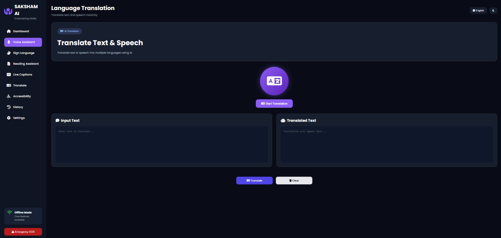
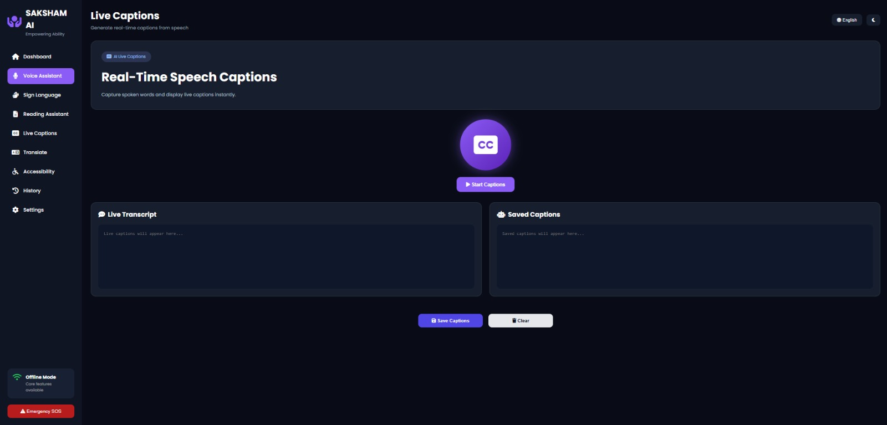

#  SAKSHAM AI
### Empowering Ability, Enhancing Life through AI-Powered Accessibility

  
  
  
  
  
  

---

#  Table of Contents

- Overview
- Problem Statement
- Project Description
- Key Features
- System Architecture
- Workflow
- Technology Stack
- Project Screenshots
- Future Scope
- Demo
- Conclusion

---

#  Overview

*SAKSHAM AI* is an AI-powered accessibility platform designed to empower individuals with visual, hearing, and speech impairments. The system integrates multiple assistive technologies into a single, offline-capable application, enabling users to communicate, access information, and navigate their surroundings independently.

Unlike conventional assistive tools that require multiple applications or constant internet access, *SAKSHAM AI* combines speech recognition, OCR, Indian Sign Language recognition, object detection, and multilingual assistance within one unified platform.

---

# 🎯 Problem Statement

Millions of individuals with *visual, hearing, and speech impairments* encounter daily barriers in communication, information access, and independent living.

Existing assistive technologies are often:

- Fragmented across multiple applications
- Expensive and inaccessible
- Dependent on internet connectivity
- Limited in multilingual support
- Unable to recognize Indian Sign Language effectively

These limitations create a critical need for an integrated, AI-powered assistive solution that promotes *inclusion, independence, and equal access for everyone*.

---

#  Project Description

*SAKSHAM AI* is an *offline, AI-powered assistive companion* that helps individuals with disabilities communicate and perform everyday tasks independently.

The application combines multiple AI technologies into one seamless platform capable of:

- 🤟 Recognizing *Indian Sign Language (ISL)* in real time
- 🎤 Converting speech into text instantly
- 📖 Reading printed documents aloud using OCR
- 👁️ Detecting objects, currency, and obstacles using Computer Vision
- 🌐 Supporting multilingual communication
- 📡 Operating completely *offline*, ensuring accessibility even in low-connectivity regions

The solution is designed with an intuitive Streamlit interface, making advanced AI accessible to everyone.

---

#  Key Features

## 🎤 Voice Assistant

- Speech-to-text conversion
- Text-to-speech responses
- Offline voice interaction
- Real-time communication assistance

---

## 🤟 Indian Sign Language Recognition

- Real-time ISL detection
- Converts signs into readable text
- Enables two-way communication
- AI-powered gesture recognition

---

## 📖 Reading Assistant (OCR)

- Reads books
- Reads printed documents
- Reads labels
- Reads signboards
- Converts printed text into speech

---

## 👁️ Object Detection

- Detects surrounding objects
- Identifies obstacles
- Currency recognition
- Navigation assistance for visually impaired users

---

## 📡 Offline Functionality

Works without an internet connection, making it suitable for:

- Rural areas
- Disaster situations
- Low-connectivity environments

---

#  System Architecture

---
#  Workflow

#  Technology Stack

| Category | Technologies |
|----------|--------------|
| *Frontend* | Streamlit, HTML, CSS |
| *Backend* | Python |
| *Voice Assistant* | SpeechRecognition, PyAudio, pyttsx3 |
| *Object Detection* | YOLOv8, OpenCV |
| *OCR* | EasyOCR, OpenCV |
| *ISL Recognition* | MediaPipe, TensorFlow / Scikit-learn |
| *Utilities* | NumPy, Pillow |
| *Version Control* | Git, GitHub |

---
## 📸 Project Screenshots

### SAKSHAM-AI - Complete UI Overview

<table>
  <tr>
    <td align="center"> <strong>1. Dashboard</strong></td>
    <td align="center"> <strong>2. Voice Assistant</strong></td>
    <td align="center"> <strong>3. Sign Language</strong></td>
  </tr>
  <tr>
    <td align="center"> <strong>4. Text to Speech</strong></td>
    <td align="center"> <strong>5. Speech to text</strong></td>
    <td align="center"> <strong>6. OCR</strong></td>
  </tr>
</table>

  <em>SAKSHAM AI-Empowering every voice!</em>

#  Future Scope

- AI-powered emergency SOS system
- GPS-based navigation assistance
- Smart wearable device integration
- Real-time multilingual translation
- Cloud synchronization
- Personalized AI assistant
- Mobile application for Android and iOS
- Healthcare monitoring integration

---
#  Demo Video

#  Conclusion

SAKSHAM AI represents a significant step toward creating a more inclusive society by combining multiple accessibility technologies into one intelligent platform.

Its offline capability, multilingual support, and AI-powered assistance make it a practical solution for individuals with disabilities, particularly in rural and underserved communities.

By empowering users with greater independence, improving communication, and enhancing accessibility, *SAKSHAM AI* strives to bridge the gap between technology and inclusivity—ensuring that accessibility is not a privilege but a right for everyone.

---

## ❤️ Built with passion for an inclusive future

### *SAKSHAM AI*
*Empowering Ability • Enhancing Life*

